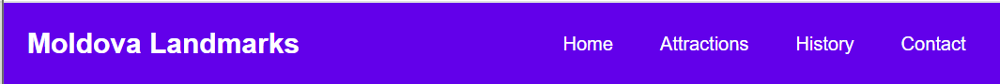
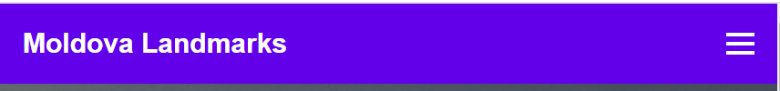

# Moldova Landmarks Landing Page

## Overview

This is a landing page dedicated to showcasing the beauty and historical significance of Moldova's landmarks. The page provides information about top attractions, a brief introduction to the MoldTrip agency, and an easy-to-use contact form for inquiries and tour requests.

## Sections

### 1. Header

- Includes the logo of "Moldova Landmarks" for easy recognition.
- Navigation bar with links to different sections of the page: Home, Attractions, History, and Contact.

- Adding a button hamburger for mobile version(i used little JS as at example at https://www.w3schools.com/howto/tryit.asp?filename=tryhow_js_mobile_navbar)

### 2. Hero Section

- Welcoming headline and brief description of Moldova's charm.
- Call-to-action button that scrolls to the attractions section.
- Also I added some responsive design here(сhanging the text)

### 3. About MoldTrip

- Introduction to the MoldTrip travel agency.
- Explains the agency’s mission to provide unique and immersive travel experiences across Moldova.
- Styled with padding and background to separate it from other sections for readability.

### 4. Attractions Section

- Grid layout showcasing the top landmarks in Moldova, including:
  - Chisinau
  - Old Orhei
  - Bendery Fortress
  - Forest Codri
  - Lake Beleu
  - Milestii Mici
- Each card contains an image, title, and a short description of the landmark.

### 5. Contact Form

- Clean and responsive contact form for visitors to request more information or book a tour.
- Includes fields for name, email, phone number, and message.
- Styled with borders, shadows, and padding for a polished look.

### 6. Footer

- Displays essential contact information, including email, phone number, and physical address.
- Copyright notice for the Moldova Landmarks project.

### 7. Mascot

- The sheep represents a cute personification of the nature of Moldova, it is animated and a message is displayed when hovering over it.
- Greets the user and invites them to explore the site.
  

## Technologies Used

- **HTML5** for structure and content organization.
- **CSS3** for styling, layout, and responsive design.
- **JS** for button hamburger

## Features

- Smooth navigation with anchor links.
- Responsive grid layout for attractions.
- Stylish and accessible contact form with input validation.
- Clean and modern design focused on usability and visual appeal.

### Deploing a link 
https://nedealcovairina.github.io/tum-web-lab2/
